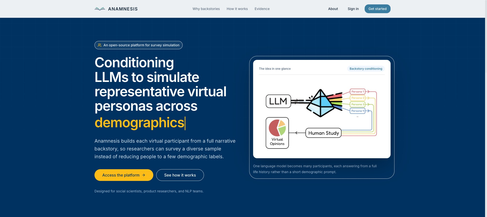
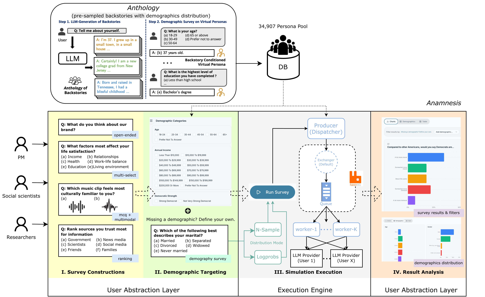

<div align="center">

# Anamnesis

### An Open-Source Platform for Large-Scale Backstory-Conditioned Survey Simulation

<span style="white-space:nowrap;">Song-Ze Yu</span>&nbsp;·
<span style="white-space:nowrap;">Joseph Suh</span>&nbsp;·
<span style="white-space:nowrap;">Serina Chang</span>&nbsp;·
<span style="white-space:nowrap;">David M. Chan</span>

<sub>Berkeley Artificial Intelligence Research (BAIR) · University of California, Berkeley</sub>

<br/>

[](https://arxiv.org/abs/2607.10628)
[](https://arxiv.org/abs/2607.10628)
[](https://simulate.group/)
[](https://youtu.be/j5yrnJl287g?list=PL0RJ6nWgJqURxHgh0X4TJNPzUIP_jFO3y)
[](LICENSE)

</div>

<p align="center">
  <a href="https://simulate.group/">
    
  </a>
</p>

---
## TL;DR

Simulating representative virtual persona groups with LLMs is one of the hottest topics in the Bay Area right now. Companies like Simile, Synthetic Users, Expected Parrot (YC F25), and Artificial Societies show the potential of LLM population simulation - but most remain closed-source.

With Anamnesis, we enable non-technical users and researchers to prototype and stress-test surveys on virtual populations built from narrative backstories - drawing on our prior work, Anthology and Alterity - and study how different demographic groups might respond, without writing a line of code.

We support demographic resampling, open-ended responses, and even multimodal surveys with images and audio. In experiments on Pew Research Center surveys and the New Yorker Caption Contest, backstory-conditioned virtual populations matched real human response distributions more closely than standard persona prompting or LLM-as-a-judge approaches.

> *Anamnesis* (ἀνάμνησις): the Platonic concept of recollection - recovering knowledge from within. Here, backstories serve as that inner context, eliciting a specific human perspective from within the model.

---

## How It Works

<p align="center">
  
</p>

Backstories are generated once, offline, by Anthology and Alterity: each virtual participant is built from a full narrative, not a demographic label. Anamnesis samples from this pool (currently 34,907 backstories) and runs surveys against it end-to-end in the browser - construct, target, simulate, analyze.

---

## Quick Start

Requires Node 18+, Python 3.11+, a Supabase project, Docker, and an OpenRouter API key or vLLM endpoint.

### 1. Frontend

```bash
cd frontend
npm install
cp .env.example .env
# Edit .env: add VITE_SUPABASE_URL and VITE_SUPABASE_ANON_KEY
npm run dev         # http://localhost:5173
```

### 2. Database

Run migrations in order in your Supabase SQL editor:

```bash
ls supabase/migrations/   # apply in filename order
```

### 3. Worker Stack

```bash
cp .env.example .env
# Edit .env: SUPABASE_URL, SUPABASE_SERVICE_KEY, RABBITMQ_USER, RABBITMQ_PASS

docker compose up -d
docker compose up -d --scale worker=4   # scale to 4 parallel workers
```

LLM API keys are stored per-user in the Supabase Vault via the Settings page, scoped per named endpoint.

---

## Project Structure

```
anamnesis/
├── frontend/src/
│   ├── pages/          # 14 route pages
│   ├── components/     # ui, layout, surveys (incl. batch dialogs), results,
│   │                   # demographic-surveys, settings
│   ├── lib/             # surveyRunner, backstoryFilters, backstoryScoring,
│   │                   # demographicPrompt, hungarianMatching, bayesianStability,
│   │                   # csvExport, llmConfig, apiKeyUtils, media
│   ├── hooks/           # useAuth, useSurveyRun, useBatchSelection
│   └── types/           # database.ts (all TypeScript types)
├── worker/
│   ├── main.py          # Async event loop + message handler
│   └── src/
│       ├── dispatcher.py    # DB polling, concurrency throttling
│       ├── worker.py        # TaskProcessor + FillingStrategies
│       ├── llm.py           # UnifiedLLMClient (OpenRouter + vLLM)
│       ├── prompt.py        # Anthology prompt format
│       ├── parser.py        # Tier 2 MCQ parser LLM
│       ├── logprobs.py      # Token log-prob → distribution
│       └── bayesian_stability.py  # Convergence/stability checks
├── supabase/migrations/ # 27 SQL migrations
└── docker-compose.yml   # RabbitMQ + Dispatcher + Worker
```

---

## Citation

Accepted to the **EMNLP 2026 Demo Track**. If you use Anamnesis in your research, please cite:

```bibtex
@inproceedings{yu2026anamnesis,
  title     = {Anamnesis: An Open-Source Platform for Large-Scale Backstory-Conditioned Survey Simulation},
  author    = {Yu, Song-Ze and Suh, Joseph and Chang, Serina and Chan, David M.},
  booktitle = {Proceedings of the 2026 Conference on Empirical Methods in Natural Language Processing: System Demonstrations},
  year      = {2026},
  note      = {arXiv:2607.10628}
}
```

---

## Development

```bash
cd frontend && npm run test       # unit tests
npm run test:e2e                  # e2e tests
cd worker && pytest               # worker tests
```

---

Copyright (C) 2026 The Regents of the University of California.
Licensed under [AGPL-3.0](LICENSE).

Updated: 8/26/2026
